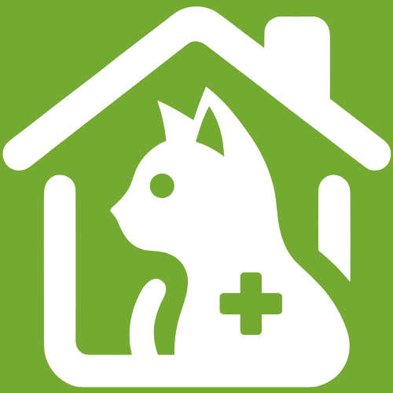

# PetConnect CRM

<p align="center">
  
</p>

<p align="center">
  <a href="https://opensource.org/licenses/MIT"></a>
  <a href="https://github.com/Florida2DAM/pfc-23-24-DavidHervas12/tag/v1.0.0"></a>
  <a href="mailto:david.hervas456@gmail.com"></a>
  <a href="https://github.com/DavidHervas12"></a>
</p>

[Video demo](https://youtu.be/Lp9F0MCTPVg?si=H45bnqXt5ZBBFrwG)

## Description

My project involves creating a web-based CRM application that helps animal shelters efficiently manage their client relationships through a simple and intuitive interface. It offers a centralized platform for tracking, managing, and storing contacts, lists, animals, and adoptions.

The main features of my application include contact management, which allows for the registration and storage of detailed information about donors, volunteers, potential adopters, veterinarians, and other important individuals. It also allows storing contacts in lists for better organization and segmentation. Animal registration provides detailed records of animals in the shelter, including information about their name, type, weight, age, health status, etc. Additionally, it includes the registration of adoption applications and tracking the adoption process.

My idea is to provide greater efficiency by centralizing data and processes related to managing the animal shelter. Another advantage is organizational improvement by tracking animals and contacts. Finally, there is a significant advancement in transparency by providing detailed information about adoptions.

## Technologies Used

- **Frontend**: Laravel Blade, html, tailwind css
- **Backend**: Laravel, php
- **Base de Datos**: MySQL
- **Despliegue**: Railway

## Installation

1. Clone the repository:
    ```bash
    git clone https://github.com/Florida2DAM/pfc-23-24-DavidHervas12.git
    ```
3. Install PHP dependencies using Composer:
    ```bash
    composer install
    ```
4. Install Node.js dependencies:
    ```bash
    npm install
    ```
5. Create a MySQL database named petconnect.

6. Update the database credentials in the `.env` file:
    ```plaintext
    DB_CONNECTION=mysql
    DB_HOST=127.0.0.1
    DB_PORT=3306
    DB_DATABASE=petconnect
    DB_USERNAME=root
    DB_PASSWORD=
    ```

7. Run the migrations:
    ```bash
    php artisan migrate:fresh
    ```
    
8. Seed the database:
    ```bash
    php artisan db:seed
    ```

## Usage

1. Start the backend server:
    ```bash
    php artisan serve
    ```
    
2. Compile the frontend assets:
    ```bash
    npm run dev
    ```

The application will be available at http://localhost:8000.

## Test User

| Email              | Password     |
|--------------------|--------------|
| dhervas456@gmail.com | 12345678   |
